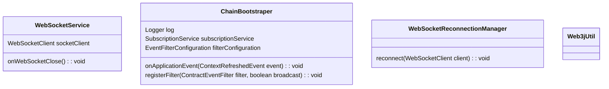

# State Of The Art

## eventeum

```mermaid

classDiagram

    class WebSocketService {
        WebSocketClient socketClient
        onWebSocketClose(): void
    }
    class ChainBootstraper {
        Logger log
        SubscriptionService subscriptionService
        EventFilterConfiguration filterConfiguration
        onApplicationEvent(ContextRefreshedEvent event): void
        registerFilter(ContractEventFilter filter, boolean broadcast): void
    }
    class WebSocketReconnectionManager {
        reconnect(WebSocketClient client): void
    }
    class Web3jUtil {
        
    }
    
  
```
